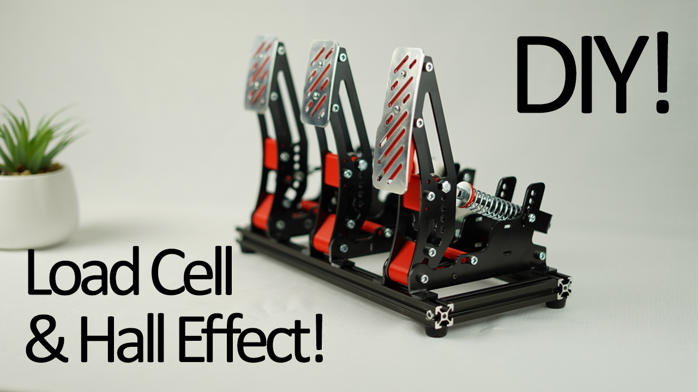

# 🦶 SimPedal — DIY 赛车模拟器踏板

> 一套激光切割 + 3D 打印 + 霍尔传感器 + 压力传感器（load cell）的赛车模拟器踏板。  
> 原始设计来自 **CNCDan**，经适配整合进本套方案。



---

## 📐 设计理念

我们的目标是做一套**无妥协、低成本**的高品质模拟赛车踏板。所有踏板的底座可互换——你可以自由搭建油门、刹车、离合的任意组合。每个踏板都同时支持**霍尔传感器**（非接触、无磨损）和**压力传感器**（load cell，力度感应），你可以根据需求混搭使用。

---

## 🗂️ 文件夹结构

```
SimPedal/
├── MetalComponents/
│   ├── Aluminium Pedal Plates/     ← 2mm 铝合金踏板面板 (DXF)
│   └── Steel Parts/                ← 2mm & 3mm 钢制结构件 (STEP, DXF, PDF)
├── PrintedComponents/              ← 3D 打印 STL 文件
│   ├── ControlBox控制盒/           ← 控制器外壳
│   ├── Brake pedal form x1.STL
│   ├── Hall Effect Mount x2.STL
│   ├── Pedal Mount x2.STL
│   └── ...（详见下方清单）
├── PedalCode/                      ← 固件代码（Arduino / CircuitPython）
│   ├── code.py / boot.py           ← 主程序
│   └── lib/                        ← 依赖库（HX711 等）
├── ShellBase.CATPart               ← CATIA 参考模型
└── README.md                       ← 你在这里
```

---

## 🖨️ 3D 打印件清单（PrintedComponents）

以下文件均为 `.STL` 格式，文件名中的数量以标准三踏板（油门+刹车+离合）为基准。

| 文件名 | 数量 | 用途 |
|---|---|---|
| `Brake pedal form x1.STL` | 1 | 刹车踏板主体 |
| `Clevis Spacer x12.STL` | 12 | U 形夹垫片 |
| `ControlBox控制盒/` | 1 套 | 控制器外壳（含底板+上盖） |
| `Foot Rest Support (Mirror pair) x1.STL` | 1 对 | 脚踏支撑（左右镜像） |
| `Foot Rest Support x1.stl` | 1 | 中间脚踏支撑 |
| `Hall Effect Mount x2.STL` | 2 | 霍尔传感器安装座 |
| `Limit Stop Tube x6.STL` | 6 | 限位管 |
| `Pedal Bearing Crush Tube x3.STL` | 3 | 轴承压紧套管 |
| `Pedal Bearing Mount x3.STL` | 3 | 轴承安装座 |
| `Pedal Mount Throttle x1.STL` | 1 | 油门专用踏板座 |
| `Pedal Mount x2.STL` | 2 | 通用踏板座（刹车/离合） |
| `Pedal Spacer x3.STL` | 3 | 踏板间隔垫片 |
| `Slide Bush x6.STL` | 6 | 滑动衬套（弹簧机构） |
| `Spring Seat x6.STL` | 6 | 弹簧底座 |

---

## 🔩 金属件清单

### 铝合金踏板面板（2mm）

激光切割 2mm 铝合金板，给你的踏板带来金属质感。

| 文件 | 用途 |
|---|---|
| `2mm Brake & Clutch Pedal Plate Sheet Metal.DXF` | 刹车和离合踏板面板 |
| `2mm Throttle Pedal Plate Sheet Metal.DXF` | 油门踏板面板（加长） |

> 💡 **提示：** 如果你不打算用金属面板，就无需打印 `Pedal Mount` 和 `Brake pedal form`——因为打印版踏板已把底座和面板做成一体了。

### 钢制零件（2mm & 3mm）

激光切割钢材，部分需要折弯（附有 PDF 折弯说明）。

| 文件 | 厚度 | 数量 | 备注 |
|---|---|---|---|
| `Foot Plate` | 2mm | 1 | 底部脚踏板 |
| `Angled Load Cell Bracket` | 3mm | 1 | 需要折弯（见 PDF） |
| `Brake Spring Back Plate` | 3mm | 1 | 需要折弯（见 PDF） |
| `Load Cell Mounting Plate` | 3mm | 2 | 平板 |
| `Pedal Base Plate` | 3mm | 3 | 需要折弯（见 PDF） |
| `Pedal Base Plate Mirrored` | 3mm | 3 | 镜像版（见下方省钱技巧） |
| `Pedal Side Plate` | 3mm | 6 | 平板 |
| `Spring Back Plate` | 3mm | 2 | 需要折弯（见 PDF） |

> 💰 **省钱技巧：** 如果你自己动手折弯，只需订购 6× `3mm Pedal Base Plate`，跳过镜像版。两者是同一个零件，只是折弯方向相反——翻个面就行。

每个需折弯的零件都包含：
- `.STEP` — 3D CAD 模型
- `.DXF` — 2D 切割文件（发激光/水刀加工）
- `.pdf` — 折弯说明图

---

## 🔌 传感器与电路

### 传感器方案

本设计支持**两种传感器**，可跨踏板混搭使用：

#### 霍尔传感器（非接触式、无磨损）

- **传感器：** 2× 线性霍尔传感器（如 49E 或比例输出型）
- **磁铁：** 2× 6×2mm 钕磁铁
- **原理：** 磁铁随踏板臂移动 → 传感器检测磁场变化 → 输出踏板位置信号

#### 压力传感器 / Load Cell（力度感应——推荐用于刹车）

- **传感器：** 1× NA151 200kg 压力传感器（或同类）
- **放大器：** 1× HX711 模块
- **原理：** 踏板压力使 load cell 产生形变 → 电阻变化 → HX711 读取力值 → 刹车力度信号

### 控制器方案

提供两套固件：

| 固件 | 主控板 | 语言 | 状态 |
|---|---|---|---|
| `PedalCode/`（原版 Arduino） | 32u4 芯片（Pro Micro / Leonardo） | Arduino C++ | ✅ 已验证 |
| `PedalCode/`（CircuitPython） | RP2040（Pico） | Python | 🧪 实验性 |

> ⚠️ Arduino 版代码需要在 Arduino IDE 中安装 **HX711 库**，在库管理器中搜索即可安装。

---

## 🛠️ 制作步骤

### 第一步：采购物料

#### 物料清单（BOM）—— 三踏板套装

| 物料 | 数量 | 参考链接（示例） |
|---|---|---|
| 625 轴承 | 6 | [淘宝 / 1688 搜索] |
| 6×2mm 磁铁 | 2 | [淘宝 / 1688 搜索] |
| 霍尔传感器 | 2 | [淘宝 / 1688 搜索] |
| NA151 Load Cell 200kg | 1 | [淘宝 / 1688 搜索] |
| HX711 放大器模块 | 1 | [淘宝 / 1688 搜索] |
| M6 鱼眼杆端（Si6M6） | 3 | [淘宝 / 1688 搜索] |
| 6×12×8 挡圈 | 3 | [淘宝 / 1688 搜索] |
| 2020 铝型材 370mm | 2 | [淘宝 / 1688 搜索] |
| 2020 铝型材 130mm | 2 | [淘宝 / 1688 搜索] |
| 2020 角码 | 4 | [淘宝 / 1688 搜索] |

#### 螺丝螺母清单

| 规格 | 数量 | 用途 |
|---|---|---|
| M5×50 内六角 | 9 | 主体结构 |
| M5×40 内六角 | 15 | 踏板组装 |
| M6×40 内六角 | 3 | Load cell 安装 |
| M6×130 内六角（最小值，可更长） | 3 | 转轴（可用长螺杆代替） |
| M5 螺母 | 21 | 通用 |
| M5 防松螺母 | 6 | 活动关节 |
| M6 螺母 | 6 | 转轴 |
| M4×16 圆头内六角 | 6 | 仅用于金属踏板面板 |
| M5 垫圈 | 12 | 间隔 |
| M6 大垫圈 | 3 | 转轴轴承 |

### 第二步：3D 打印所有零件

- 材料推荐：**PETG 或 ABS**（PLA 在受力/高温下可能变形）
- 填充率：结构件 40-60%，垫片类 20%
- 支撑：轴承座和控制盒外壳需要加支撑
- 控制盒零件在 `PrintedComponents/ControlBox控制盒/` 下

### 第三步：定制金属件

- 将 `.DXF` 文件发给激光切割加工商
- 踏板面板选 2mm 铝合金，结构件选 2mm/3mm 钢板
- 需折弯的零件一并提供 `.pdf` 折弯说明
- 参考价格：人民币 200-400 元（视地区而定）

### 第四步：组装框架

1. 用 2020 角码把铝合金型材搭成底座框架
2. 将脚踏板固定到型材框架上
3. 将踏板底座安装到脚踏板上
4. 安装踏板侧板、轴承和压紧套管

### 第五步：安装传感器

#### 霍尔传感器安装
1. 将磁铁压入踏板臂的磁铁槽中
2. 将霍尔传感器安装在 `Hall Effect Mount` 支架上
3. 调整位置，使磁铁在全行程范围内距传感器面约 2-3mm
4. 位置确认后可用热熔胶固定

#### Load Cell 安装（刹车踏板）
1. 将 Load Cell 安装在 `Angled Load Cell Bracket` 和 `Load Cell Mounting Plate` 之间
2. 接线到 HX711 模块（E+、E-、A+、A-、VCC、GND）
3. HX711 的 DT 和 SCK 分别接 Arduino 对应引脚

### 第六步：烧录固件

#### Arduino（32u4 开发板）
```
1. 在 Arduino IDE 中安装 HX711 库
2. 打开踏板代码工程
3. 选择开发板：Arduino Leonardo 或 Pro Micro
4. 点击上传
5. 打开串口监视器（波特率 115200）
6. 输入 'Y' 回车，开始 1 分钟校准流程
7. 在校准期间反复踩踏所有踏板到极限位置
```

之后如果调整了传感器位置，随时可以重新校准。

---

## 📺 视频教程

原版制作视频：[https://youtu.be/44LWekyILmk](https://youtu.be/44LWekyILmk)

---

## 🔗 相关项目

- [🏗️ SimBase — 方向盘基座制作教程](../SimBase/README.md)
- [🏎️ SimWheeling — 方向盘制作教程](../SimWheeling/README.md)
- [📦 返回主 README](../README.md)
